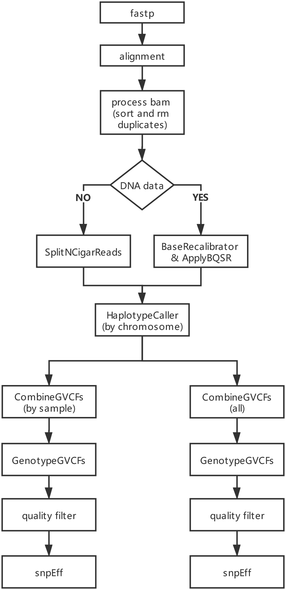

# OM reseq pipeline

## 分析流程



## 使用说明

### Getting started
```bash

# quick start
nextflow run main.nf \
    --reads 'fq_dr/*_R{1,2}.fastq.gz' \ # *通配样品名称
    --outdir result_dir \
    --known_vcf known.vcf.gz \ # 已知 snp 位点 vcf 文件，需要建立索引
    --data_type exome \ # 数据类型 [exome, reseq, rnaseq]，默认为外显子数据
    -profile slurm,conda \ 
    -resume

```

### Advanced

#### --genome
>基因组名称，默认为 tcuni1.1， 需在 --genomes_base 目录下提前准备

#### --genomes_base
>参考基因组，注释文件目录，需要准备的文件参考 conf/genomes.config

#### --aligner
>rnaseq mapping 软件 [star, hisat2]，默认 star

#### --snpEff
>snpEff 数据库路径

#### --skip_merge
>skip generating a merged vcf of all samples

